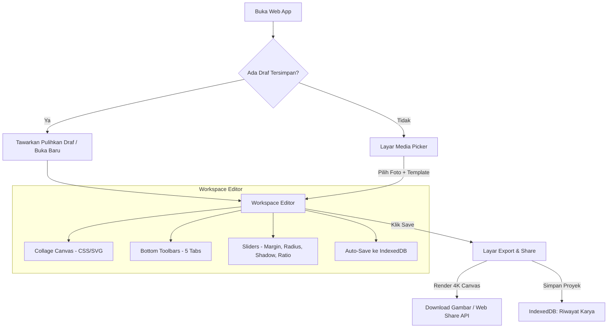

# Spesifikasi Desain: Photo Collage Web Application (Reverse Engineered)

**Tanggal:** 2026-09-05  
**Tipe Proyek:** Web Application (Responsive Mobile & Laptop)  
**Status:** Validated & Approved by User  
**Basis Referensi:** Rekaman Layar iOS App (`IMG_9833.MP4`)

---

## 1. Ringkasan Proyek & Tujuan

Aplikasi ini adalah hasil *reverse engineering* dari aplikasi kolase foto mobile iOS populer tanpa batasan *paywall*, yang dapat diakses melalui browser di *smartphone* (tampilan 100% menyerupai aplikasi iOS native) maupun laptop/PC (tampilan adaptif dengan bilah perkakas responsif).

Aplikasi beroperasi secara **100% Client-Side** tanpa ketergantungan server atau biaya langganan, mengutamakan privasi pengguna, performa mulus (60fps), hasil ekspor beresolusi tinggi (hingga 4K), serta fitur penyimpanan draf otomatis dan riwayat karya menggunakan database lokal **IndexedDB**.

---

## 2. Fitur Utama & Kebutuhan Fungsional

### A. Media Picker & Bottom Sheet Layout
1. **Pemilihan Foto:**
   - Unggah beberapa foto sekaligus dari galeri perangkat / file explorer.
   - Pilihan tab `RECENTS` dan `FAVORITES` (atau filter folder).
   - Indikator centang pink/magenta `✓` pada foto yang terpilih.
   - Status bar bawah: `X Photos Selected` dan tombol navigasi `Next >`.
2. **Katalog Layout Kolase:**
   - **Tab CLASSIC:** Puluhan variasi grid persegi untuk 1 hingga 10+ foto (split 50/50, 70/30, 3 baris/kolom, 2x2, 3x3, asimetris).
   - **Tab STYLISH:** Puluhan variasi potongan poligon & diagonal unik menggunakan SVG `clip-path` (Diagonal slices, Origami triangles, Chevron/Envelope folds, Isometric 3D Cube, Parallelogram bands, Octagram/Star cutout).
   - Lembar geser bawah (*expandable bottom sheet*) yang dapat ditarik ke atas untuk menjelajahi katalog layout secara menyeluruh.

### B. Workspace Editor Kolase
1. **Top Navigation Bar:**
   - Tombol Batal/Keluar (`✕`): Konfirmasi kembali ke galeri atau beranda.
   - Tombol Undo (`↶`): Mengembalikan perubahan terakhir (riwayat aksi per langkah).
   - Tombol Menu Pengaturan (`⚙️`): Buka panel preferensi dan informasi aplikasi.
   - Tombol `Save`: Membuka layar Export & Share dengan tombol pink mencolok.
2. **Interactive Canvas & Manipulasi Sel:**
   - **Pan Foto:** Geser foto di dalam sel untuk menentukan komposisi visual terbaik.
   - **Pinch-to-Zoom / Scroll Zoom:** Memperbesar dan memperkecil foto dengan batas minimum menutupi sel (*clamped bounds*).
   - **Swap Foto:** Drag & drop foto dari satu sel ke sel lain untuk menukar posisi.
   - **Floating Cell Toolbar (saat sel ditekan):**
     1. *Replace:* Ganti foto pada sel aktif dari file picker.
     2. *Filter:* Filter visual (B&W, Warm, Vintage, Bright, High Contrast).
     3. *Flip:* Membalik foto secara horizontal (*mirror*).
     4. *Rotate 90°:* Memutar orientasi foto 90 derajat searah jarum jam.
     5. *Delete:* Mengosongkan sel foto tersebut.

### C. Slider Kontrol Layout
Aksen warna *vibrant pink/magenta* dengan indikator angka *real-time*:
- **Aspect Ratio:** Preset instan (`1:1`, `4:5`, `9:16`, `4:3`, `16:9`, `1:2`) serta slider bebas dengan pembacaan rasio real-time.
- **Outer Margin:** Slider jarak tepi terluar dari bingkai kanvas (0px s/d 40px).
- **Inner Margin:** Slider celah/garis pemisah antar sel foto (0px s/d 30px).
- **Corner Radius:** Slider kelengkungan sudut sel foto (0px s/d 40px).
- **Shadow:** Slider intensitas dan blur bayangan di belakang setiap sel foto.

### D. Bottom Navigation Bar (5 Tab Alat Utama)
1. **Collage:** Menampilkan katalog layout dan panel slider penyesuaian dimensi.
2. **Background:** Palet warna solid, gradien warna modern, pola tekstur (kertas, grid, terrazzo), dan opsi *Blur Background* dari salah satu foto.
3. **Sticker:** Pilihan stiker estetik vektor (emotikon, sparkles, washi tape, pin, pita) yang dapat digeser, diubah ukuran, dan diputar bebas.
4. **Frame:** Bingkai polaroid, filmstrip analog, dan list tepi artistik.
5. **Text (Editor Tipografi):**
   - Layar modal khusus dengan tab *Keyboard*, *Pilihan Font*, *Kerning Slider*, dan *Color & Highlight Style*.
   - Pilihan koleksi font estetik Google Fonts (Typewriter, Bold Display, Sans Modern, Serif Klasik, Handwritten).
   - Slider *Letter Spacing* (jarak antar huruf dinamis).
   - Efek latar teks: *None*, *Solid Pill Box*, dan *Patterned Box*.
   - Interaksi di kanvas: drag, resize, rotate, dan double tap untuk mengedit kembali.

### E. Penyimpanan Lokal & Riwayat Karya (IndexedDB)
1. **Auto-Save Recovery:** Otomatis menyimpan state kanvas setiap terjadi modifikasi. Jika browser tertutup tidak sengaja, draf dipulihkan saat dibuka kembali.
2. **Galeri Riwayat Proyek ("Karya Saya"):**
   - Menampilkan thumbnail kolase yang pernah dibuat sebelumnya.
   - Informasi tanggal dan jumlah foto.
   - Aksi: Buka Kembali / Lanjut Edit, Duplikat, dan Hapus.
3. **Cadangkan & Pulihkan (Export/Import Project JSON):**
   - Kemudahan transfer proyek antar perangkat (misal dari HP ke Laptop) tanpa internet/server.

### F. Layar Export & Share (4K High-Res)
- Mesin render *Offscreen Canvas* resolusi tinggi (2048x2048 atau 4K).
- Tombol **Save** (lingkaran pink besar): Download langsung file PNG/JPEG jernih tanpa watermark.
- Tombol **Share** (lingkaran ungu tua): Memanggil Web Share API untuk membagikan gambar langsung ke aplikasi pesan / medsos.
- Shortcut format media sosial: Instagram Story, Instagram Post, Facebook Post, WhatsApp.

---

## 3. Arsitektur Teknis

### A. Tech Stack
- **Framework:** Next.js (App Router), React 18/19, TypeScript
- **Styling & Design System:** Tailwind CSS + Vanilla CSS Variables (iOS glassmorphism, pink accent `#ff2b6d`, dark/light theme)
- **Icons:** Lucide React
- **Local Storage:** `idb` (IndexedDB Wrapper ringan dan handal)
- **Image Processing & Export:** HTML5 Canvas 2D Context API

### B. Diagram Alur Sistem

---

## 4. Rencana Verifikasi & Pengujian
1. **Verifikasi Responsif Mobile:** Uji coba gestur sentuh (touch pan, pinch zoom, drag swap) dan UI bottom sheet di layar mobile kecil (375px - 430px).
2. **Verifikasi Tampilan Laptop/Desktop:** Pastikan kanvas berada di tengah dengan ukuran proporsional dan bilah perkakas tertata rapi.
3. **Verifikasi Poligon Stylish:** Memastikan semua potongan diagonal dan kubus 3D terender dengan presisi tanpa celah aneh.
4. **Verifikasi Kualitas Ekspor:** Memastikan gambar hasil unduhan tajam (DPI tinggi), teks tidak terpotong, dan font tersemat sempurna.
5. **Verifikasi Auto-Save & Recovery:** Uji coba memuat ulang browser saat sedang mengedit untuk memastikan draf kembali tanpa kehilangan data.
